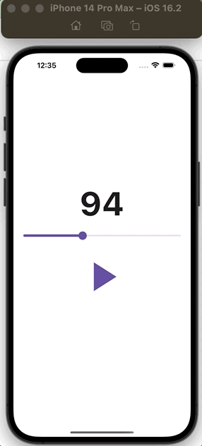
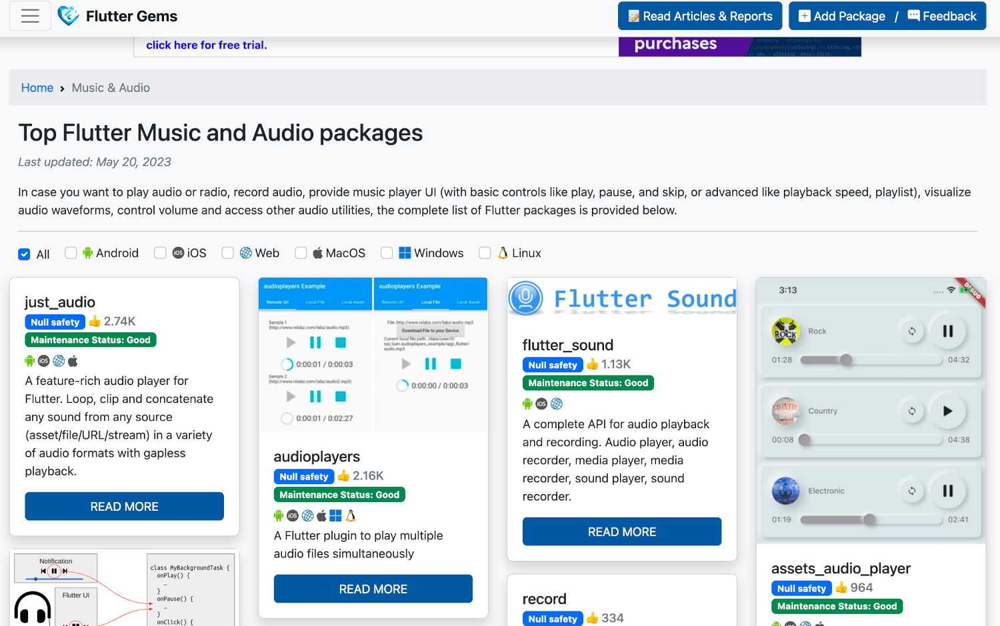
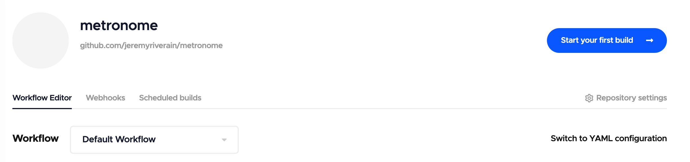
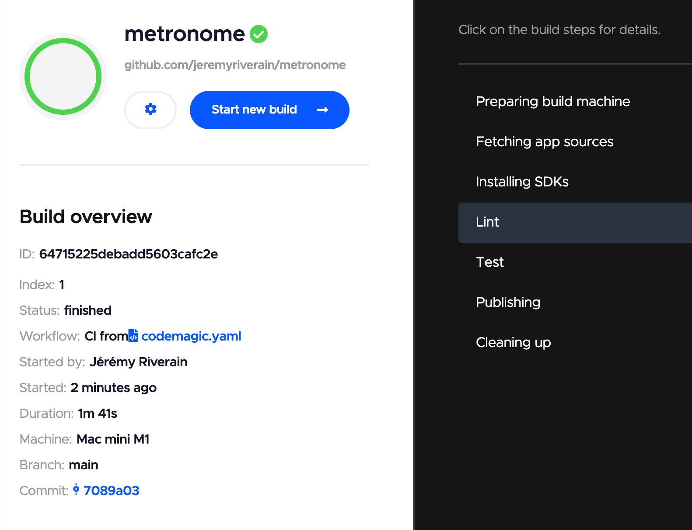

summary: Dans ce codelab, vous allez apprendre à développer une application Flutter en réalisant un métronome
id: docs
categories: Flutter
tags: beginner
status: Published
authors: Jérémy Riverain
Feedback Link: https://github.com/Zenika/codelab-flutter-metronome/issues

# Développer une application Flutter

<!-- ------------------------ -->

## Introduction

Duration: 2

### Présentation de Flutter


[Flutter](https://flutter.dev/) est un framework open-source développé par Google qui permet de créer des applications mobiles multiplateformes. Voici quelques points clés concernant Flutter :

**Développement multiplateforme:** Flutter permet aux développeurs de créer des applications pour différentes plateformes telles qu'Android, iOS, le web, Windows, macOS, Linux en utilisant un seul code source.

**Langage de programmation:** Flutter utilise le langage de programmation [Dart](https://dart.dev/), qui est également développé par Google. Dart est un langage moderne avec des fonctionnalités telles que le typage statique et la gestion automatique de la mémoire.

**Interface utilisateur réactive:** Flutter propose un moteur de rendu personnalisé qui permet la création d'interfaces utilisateur réactives. Cela garantit des performances élevées et une expérience utilisateur fluide. Flutter propose une vaste collection de widgets pré-construits et personnalisables. Les développeurs peuvent personnaliser l'apparence et le comportement des widgets selon leurs besoins spécifiques.

**Communauté active:** Flutter bénéficie d'une communauté de développeurs active, ce qui offre un accès à de nombreux packages, tutoriels et ressources pour faciliter le développement d'applications.

**Intégration native:** Flutter permet l'accès aux fonctionnalités natives des différentes plateformes grâce à des plugins. Cela permet aux développeurs d'intégrer des fonctionnalités spécifiques à chaque plateforme, telles que l'appareil photo, le GPS, les notifications push, etc.

**Expérience de développement rapide:** Flutter offre une fonctionnalité de Hot Reload, qui permet aux développeurs de voir les résultats immédiatement lorsqu'ils apportent des modifications à leur code, sans avoir à recompiler toute l'application. Cela facilite un processus de développement itératif et accélère la création d'applications.

### Ce que vous allez réaliser

Vous allez réaliser un métronome avec Flutter.

L'interface utilisateur sera simple, intuitive, comme le montre cette capture d'écran:



### Ce que vous apprendrez

- ✅ utiliser les types de widgets les plus répandus dans Flutter (Stateless, Stateful, Inherited)
- ✅ rendre une application responsive
- ✅ tester votre application
- ✅ mettre en place une pipeline d'intégration continue

<!-- ------------------------ -->

## Créer l'application

Duration: 1

### Cas 1: Flutter EST INSTALLÉ sur votre poste

Flutter doit être correctement installé sur votre poste.

En particulier, la commande `flutter doctor` ne doit pas renvoyer d'erreur.


J'utilise la version `3.10` de Flutter, et donc Dart 3. La très grande majorité du code de l'application est compatible avec Dart `> 2.12`. Les tests sont à priori le seul endroit où j'ai utilisé des Records et des Patterns (fonctionnalités de Dart non disponibles dans Dart 2). Si vous êtes encore sur Dart 2, je vous recommande donc de mettre à jour Flutter, ou éventuellement adapter les sections de ce codelab qui ne compileront pas à cause d'API incompatibles.

Si tout est OK, vous pouvez directement créer votre application.

```
flutter create metronome
```

Une fois votre application générée, vous pouvez supprimer le dossier `test` et le fichier `lib/main.dart`.

### Cas 2: Flutter N'EST PAS INSTALLÉ sur votre poste

Si vous n'avez pas encore Flutter, je vous invite à suivre les [instructions de démarrage officielles](https://docs.flutter.dev/get-started/install) jusqu'à ce que vous puissiez lancer la commande `flutter doctor` sans erreur.

<!-- ------------------------ -->

## Ajouter les premiers composants structurants

Duration: 15

### Afficher "Hello Flutter"

```dart
// lib/main.dart

import 'package:flutter/material.dart';
import 'package:metronome/app.dart';

void main() {
  runApp(const App());
}
```

```dart
// lib/ui/app.dart

import 'package:flutter/material.dart';

class App extends StatelessWidget {
  const App({super.key});

  @override
  Widget build(BuildContext context) {
    return MaterialApp(
      home: Scaffold(
        body: Center(
          child: Text(
            'Hello Flutter',
            style: Theme.of(context).textTheme.displayMedium,
          ),
        ),
      ),
    );
  }
}
```

### Afficher le rythme du métronome

```dart
// lib/ui/rhythm_label.dart

import 'package:flutter/material.dart';

class RhythmLabel extends StatelessWidget {
  const RhythmLabel({super.key});
  @override
  Widget build(BuildContext context) {
    return Text(
      '50',
      style: Theme.of(context).textTheme.displayLarge?.copyWith(
            fontSize: 80,
            fontWeight: FontWeight.bold,
          ),
    );
  }
}
```

```dart
// lib/ui/app.dart

import 'package:flutter/material.dart';
import 'package:metronome/ui/rhythm_label.dart'; // importer RhythmLabel

class App extends StatelessWidget {
  const App({super.key});

  @override
  Widget build(BuildContext context) {
    return MaterialApp(
      home: Scaffold(
        body: RhythmLabel(), // remplacer le texte précédent par RhythmLabel
      ),
    );
  }
}
```

### Créer un fichier pour stocker les constantes de notre application

Nous allons créer un fichier pour stocker quelques constantes. En soi, la séparation de ces constantes dans un fichier à part n'est pas nécessaire, si ce n'est que nous allons réaliser des tests à la fin du codelab. Nous aurons besoin d'accéder à certaines constantes lors de nos tests pour effectuer quelques assertions.

Je vous propose donc d'anticiper dès maintenant la création du fichier `lib/constants.dart`. Le fichier final contiendra ces 5 constantes:

```dart
// lib/constants.dart
import 'package:flutter/material.dart';

// représente le rythme du métronome par défaut quand on arrive dans l'application
const kDefaultRhythm = 50;

// rythme minimum du métronome
const kMinRhythm = 30;

// rythme maximum du métronome
const kMaxRhythm = 200;

// icône du bouton "lecture"
const kPlayIcon = Icons.play_arrow;

// icône du bouton "pause"
const kPauseIcon = Icons.pause;
```

### Afficher le "slider" permettant de modifier le rythme

```dart
// lib/ui/rhythm_slider.dart

import 'package:flutter/material.dart';
import 'package:metronome/constants.dart';

class RhythmSlider extends StatelessWidget {
  const RhythmSlider({super.key});
  @override
  Widget build(BuildContext context) {
    return Slider(
      value: 50,
      min: kMinRhythm.toDouble(),
      max: kMaxRhythm.toDouble(),
      onChanged: (value) {},
    );
  }
}
```

```dart
// lib/ui/app.dart
import 'package:flutter/material.dart';
import 'package:metronome/ui/rhythm_label.dart';
import 'package:metronome/ui/rhythm_slider.dart'; // importer RhythmSlider

class App extends StatelessWidget {
  const App({super.key});

  @override
  Widget build(BuildContext context) {
    return MaterialApp(
      home: Scaffold(
        body: Column(
          // utiliser Column pour afficher plusieurs widgets dans une colonne
          mainAxisAlignment: MainAxisAlignment.center,
          children: [
            RhythmLabel(),
            Padding( // ajouter un peu d'espacement en haut et en bas du slider
              padding: const EdgeInsets.symmetric(vertical: 8),
              child: RhythmSlider(), // utiliser RhythmSlider
            ),
          ],
        ),
      ),
    );
  }
}
```

### Afficher le bouton permettant de démarrer/arrêter le métronome

```dart
// lib/ui/sound_toggle_button.dart

import 'package:flutter/material.dart';
import 'package:metronome/constants.dart';

class SoundToggleButton extends StatefulWidget {
  const SoundToggleButton({super.key});

  @override
  State<SoundToggleButton> createState() => _SoundToggleButtonState();
}

class _SoundToggleButtonState extends State<SoundToggleButton> {
  bool isPlaying = false;
  @override
  Widget build(BuildContext context) {
    return TextButton(
      onPressed: () {
        setState(() {
          isPlaying = !isPlaying;
        });
      },
      child: Icon(
        isPlaying ? kPauseIcon : kPlayIcon,
        size: 120,
      ),
    );
  }
}
```

```dart
// lib/ui/app.dart

import 'package:flutter/material.dart';
import 'package:metronome/ui/rhythm_label.dart';
import 'package:metronome/ui/rhythm_slider.dart';
import 'package:metronome/ui/sound_toggle_button.dart'; // importer SoundToggleButton

class App extends StatelessWidget {
  const App({super.key});

  @override
  Widget build(BuildContext context) {
    return MaterialApp(
      home: Scaffold(
        body: Column(
          mainAxisAlignment: MainAxisAlignment.center,
          children: [
            RhythmLabel(),
            Padding(
              padding: const EdgeInsets.symmetric(vertical: 8),
              child: RhythmSlider(),
            ),
            SoundToggleButton(), // utiliser SoundToggleButton
          ],
        ),
      ),
    );
  }
}
```

### Ajuster le thème général

```dart
// lib/ui/app.dart

import 'package:flutter/material.dart';
import 'package:metronome/ui/rhythm_label.dart';
import 'package:metronome/ui/rhythm_slider.dart';
import 'package:metronome/ui/sound_toggle_button.dart'; // importer SoundToggleButton

class App extends StatelessWidget {
  const App({super.key});

  @override
  Widget build(BuildContext context) {
    return MaterialApp(
      theme: ThemeData(
        useMaterial3: true, // activation de Material Design 3
      ),
      debugShowCheckedModeBanner: false, // dissimule la bannière "debug"
      home: Scaffold(
        body: Column(
          mainAxisAlignment: MainAxisAlignment.center,
          children: [
            RhythmLabel(),
            Padding(
              padding: const EdgeInsets.symmetric(vertical: 8),
              child: RhythmSlider(),
            ),
            SoundToggleButton(), // utiliser SoundToggleButton
          ],
        ),
      ),
    );
  }
}
```


<!-- ------------------------ -->

## Rendre l’application responsive

Duration: 10

Pour rendre une application Flutter responsive, vous disposez de plusieurs moyens. Voici 2 moyens possibles:

- [MediaQuery.of()](https://api.flutter.dev/flutter/widgets/MediaQuery-class.html): cela permet de récupérer des informations sur la taille de l'écran et d'autres caractéristiques de l'appareil.
- le widget [LayoutBuilder](https://api.flutter.dev/flutter/widgets/LayoutBuilder-class.html): il permet d'obtenir des informations sur la taille disponible dans le **widget parent** et de personnaliser la mise en page en conséquence.

Il existe d'autres possibilités. N'hésitez pas à lire la [documentation officielle](https://docs.flutter.dev/ui/layout/adaptive-responsive) pour plus de détails sur le sujet.

### Utilisation du widget LayoutBuilder

Le LayoutBuilder est un widget qui prend une fonction de rappel (callback) en tant que paramètre, et cette fonction sera invoquée à chaque fois que la taille du widget parent change. La fonction de rappel reçoit deux paramètres : le contexte ([BuildContext](https://api.flutter.dev/flutter/widgets/BuildContext-class.html)) et les contraintes ([BoxConstraints](https://api.flutter.dev/flutter/rendering/BoxConstraints-class.html)).

Les contraintes (`BoxConstraints`) fournissent des informations sur l'espace disponible pour le widget `LayoutBuilder`. Vous pouvez utiliser ces informations pour ajuster la taille et la disposition des enfants du LayoutBuilder.

Dans cet application, le `LayoutBuilder` examine la largeur maximale disponible dans le widget parent. Si cette largeur est supérieure à **500** pixels, on passe en mode `Row`, sinon on reste en mode `Column`..

```dart
// lib/ui/app.dart

import 'package:flutter/material.dart';
import 'package:metronome/ui/rhythm_label.dart';
import 'package:metronome/ui/rhythm_slider.dart';
import 'package:metronome/ui/sound_toggle_button.dart';

class App extends StatelessWidget {
  const App({super.key});

  @override
  Widget build(BuildContext context) {
    return MaterialApp(
      theme: ThemeData(
        useMaterial3: true,
      ),
      debugShowCheckedModeBanner: false,
      home: Scaffold(
        body: LayoutBuilder(builder: (context, constraints) {
          if (constraints.maxWidth > 500) { // Mise en page grand écran
            return const Row(
              mainAxisAlignment: MainAxisAlignment.center,
              children: [
                SizedBox(
                  width: 300,
                  child: Column(
                    mainAxisAlignment: MainAxisAlignment.center,
                    children: [
                      RhythmLabel(),
                      Padding(
                        padding: EdgeInsets.only(top: 8),
                        child: RhythmSlider(),
                      ),
                    ],
                  ),
                ),
                SoundToggleButton(),
              ],
            );
          }

          // Mise en page petit écran (téléphone)
          return const Column(
            mainAxisAlignment: MainAxisAlignment.center,
            children: [
              RhythmLabel(),
              Padding(
                padding: EdgeInsets.symmetric(vertical: 8),
                child: RhythmSlider(),
              ),
              SoundToggleButton(),
            ],
          );
        }),
      ),
    );
  }
}
```

<!-- ------------------------ -->

## Jouer un son à intervalle régulier

Duration: 20

L'enjeu de cette section est de jouer le son du métronome à intervalle régulier.

J'imagine qu'il serait possible de coder le lancement du son en pur Dart. Ceci dit, pour se faciliter la tâche, nous allons plutôt installer une librairie.

Pour choisir une librairie, 2 sites sont à connaître:

- l'incontournable [pub.dev](https://pub.dev/): c'est le site officiel répertoriant tous les paquets Dart et Flutter
- [fluttergems](https://fluttergems.dev/): j'apprécie ce site pour explorer le champ des possibles, sans trop savoir quel sera la librairie de mon choix. L'UI et les critères de recherche de ce site me paraissent plus intuitifs que le site officiel [pub.dev](https://pub.dev/). Je le recommande donc si vous ne savez pas trop quoi chercher.

Pour jouer le son du métronome, je jette mon dévolu sur la librairie [audioplayers](https://github.com/bluefireteam/audioplayers) que j'ai déjà utilisé sur un projet [Flame](https://docs.flame-engine.org/latest/) pour réaliser un jeu 2D avec Flutter. Cette librairie va nous permettre de facilement jouer un son provenant de nos ressources locales.



<aside class="positive">
<div>
  
</div>

Si d'aventure vous vouliez créer un jeu 2D, Flutter est un très candidat grâce au moteur de jeu <a href="https://docs.flame-engine.org/latest/">Flame</a>.

</aside>

### Installer audioplayers

Ouvrez votre terminal et exécutez la commande suivante.

```
flutter pub add audioplayers
```

### Télécharger le son du métronome

Télécharger le fichier MP3 au moyen du lien suivant:

<a href="https://github.com/Zenika/codelab-flutter-metronome/tree/main/assets/metronome-sound.mp3" download>Télécharger le son du métronome</a>

Placez ce fichier dans le dossier `assets` à la racine de votre projet. Le nom du dossier est important. Son nommage est contraint par la librairie `audioplayers` que nous utilisons.

Modifiez ensuite le fichier `pubspec.yaml` afin que Flutter ait connaissance de cette ressource locale. Renseignez dans ce fichier une nouvelle entrée au niveau du paramètre `flutter.assets`:

```yaml
# pubspec.yaml

flutter:
  assets:
    - assets/metronome-sound.mp3 # chemin vers le fichier MP3 précédemment tééchargé
  # ...
# ...
```

### Utiliser InheritedWidget en guise d'injection de dépendance

```dart
// lib/audio_player_provider.dart

import 'package:audioplayers/audioplayers.dart';
import 'package:flutter/material.dart';

class AudioPlayerProvider extends InheritedWidget {
  static AudioPlayerProvider of(BuildContext context) {
    final AudioPlayerProvider? result =
        context.dependOnInheritedWidgetOfExactType<AudioPlayerProvider>();

    if (result == null) {
      throw 'No AudioPlayerProvider found';
    }

    return result;
  }

  static Future<AudioPlayer> createAudioPlayer() async {
    final audioPlayer = AudioPlayer()
      ..setPlayerMode(
        PlayerMode.lowLatency,
      );
    await audioPlayer.setSource(AssetSource('metronome-sound.mp3'));
    return audioPlayer;
  }

  final AudioPlayer audioPlayer;

  const AudioPlayerProvider({
    super.key,
    required super.child,
    required this.audioPlayer,
  });

  @override
  bool updateShouldNotify(AudioPlayerProvider oldWidget) {
    return false;
  }
}
```

### Injecter AudioPlayerProvider dans l'application

```dart
// lib/main.dart

import 'package:flutter/material.dart';
import 'package:metronome/audio_player_provider.dart';
import 'package:metronome/ui/app.dart';

// le point d'entrée de l'application devient asynchone afin que audioplayers charge correctement le son
void main() async {

  // cet appel est désormais nécessaire pour que Flutter s'assure que les widgets soient complètement initialisés
  WidgetsFlutterBinding.ensureInitialized();

  runApp(
    // on place AudioPlayerProvider à la racine de notre application afin que n'importe quel widget de notre application puisse accéder à AudioPlayer
    AudioPlayerProvider(
      audioPlayer: await AudioPlayerProvider.createAudioPlayer(),
      child: const App(),
    ),
  );
}
```

### Jouer le son du métronome

```dart
// lib/ui/sound_toggle_button.dart

import 'dart:async';

import 'package:flutter/material.dart';
import 'package:metronome/constants.dart';
import 'package:metronome/audio_player_provider.dart';

class SoundToggleButton extends StatefulWidget {
  const SoundToggleButton({super.key});

  static Duration getRhythmInterval(int rhythm) =>
      Duration(milliseconds: ((60 / rhythm) * 1000).toInt());

  @override
  State<SoundToggleButton> createState() => _SoundToggleButtonState();
}

class _SoundToggleButtonState extends State<SoundToggleButton> {
  bool isPlaying = false;
  Timer? periodicTimer;

  @override
  void didChangeDependencies() {
    final audioPlayer = AudioPlayerProvider.of(context).audioPlayer;
    periodicTimer?.cancel();
    periodicTimer = Timer.periodic(
      SoundToggleButton.getRhythmInterval(50),
      (_) {
        if (isPlaying) {
          audioPlayer.stop();
          audioPlayer.resume();
        }
      },
    );
    super.didChangeDependencies();
  }

  @override
  void dispose() {
    periodicTimer?.cancel();
    super.dispose();
  }

  @override
  Widget build(BuildContext context) {
    return TextButton(
      onPressed: () {
        setState(() {
          isPlaying = !isPlaying;
        });
      },
      child: Icon(
        isPlaying ? kPauseIcon : kPlayIcon,
        size: 120,
      ),
    );
  }
}
```

<aside class="negative">
Comme nous venons de modifier le point d'entrée de notre application et que nous avons ajouté une nouvelle ressource, il est important que vous interrompiez votre application en cours d'exécution, et que vous la redémarriez complètement.
</aside>

Désormais, lorsque vous appuyez sur le bouton "Lecture", le son démarre et il s'interrompt dès lors que vous appuyez sur le bouton "Pause".

<!-- ------------------------ -->

## Modifier le rythme du métronome

Duration: 20

Durant cette section, nous allons apprendre comment l'association d'un _Stateful Widget_ et d'un _Inherited Widget_ peut faire office de solution simple en matière de state management.

J'ai découvert cette approche grâce à cette vidéo officielle et je la trouve particulièrement intéressante pour illustrer le fonctionnement des widgets natifs de Flutter:

<a href="https://www.youtube.com/watch?v=LFcGPS6cGrY">
  
</a>

L'approche que je vais présenter ne supplante en aucun cas les formidables (et nombreuses) librairies qui existent dans l'écosystème Flutter.

Les solutions de state management en Flutter sont nombreuses et il n'est pas simple de faire son choix. Le contexte de votre application déterminera éventuellement une approche adaptée.

Pour se faire une 1ère idée de la question et commencer à explorer le sujet, cette [documentation Flutter](https://docs.flutter.dev/data-and-backend/state-mgmt/simple) est instructive, la librairie [provider](https://pub.dev/packages/provider) étant souvent l'approche recommandée pour un débutant sur le framework.

Ci dessous d'autres librairies très populaires, chacune ayant une approche différente:

- [riverpod](https://pub.dev/packages/riverpod) (anagramme de _provider_ - c'est la V2)
- [flutter_bloc](https://pub.dev/packages/flutter_bloc)
- [flutter_redux](https://pub.dev/packages/flutter_redux)
- [mobX](https://pub.dev/packages/mobx)

La liste n'est pas exhaustive 😅.

### Inherited Widget + Stateful Widget = Simple state management

### Création de RhythmStore

```dart
// lib/store/rhythm_store.dart

import 'package:flutter/material.dart';

class RhythmStore extends InheritedWidget {
  static RhythmStore of(BuildContext context) {
    final RhythmStore? result =
        context.dependOnInheritedWidgetOfExactType<RhythmStore>();

    if (result == null) {
      throw 'No RhythmStore found';
    }

    return result;
  }

  final int rhythm;

  const RhythmStore({
    super.key,
    required super.child,
    required this.rhythm,
  });

  @override
  bool updateShouldNotify(RhythmStore oldWidget) {
    return rhythm != oldWidget.rhythm;
  }
}
```

### Création de RhythmProvider

```dart
// lib/store/rhythm_provider.dart

import 'package:flutter/material.dart';
import 'package:metronome/constants.dart';
import 'package:metronome/store/rhythm_store.dart';

class RhythmProvider extends StatefulWidget {
  static RhythmProviderState of(BuildContext context) {
    final result = context.findAncestorStateOfType<RhythmProviderState>();
    if (result == null) {
      throw 'RythmProviderState ancestor has not been found';
    }

    return result;
  }

  final Widget child;

  const RhythmProvider({
    super.key,
    required this.child,
  });

  @override
  State<RhythmProvider> createState() => RhythmProviderState();
}

class RhythmProviderState extends State<RhythmProvider> {
  int _rhythm = kDefaultRhythm;

  void updateRhythm(int val) {
    setState(() {
      _rhythm = val;
    });
  }

  @override
  Widget build(BuildContext context) {
    return RhythmStore(
      rhythm: _rhythm,
      child: widget.child,
    );
  }
}
```

### Injection de RhythmProvider à la racine de notre application

```dart
// lib/main.dart

import 'package:flutter/material.dart';
import 'package:metronome/audio_player_provider.dart';
import 'package:metronome/store/rhythm_provider.dart';
import 'package:metronome/ui/app.dart';

void main() async {
  WidgetsFlutterBinding.ensureInitialized();
  runApp(
    AudioPlayerProvider(
      audioPlayer: await AudioPlayerProvider.createAudioPlayer(),
      child: const RhythmProvider(
        child: App(),
      ),
    ),
  );
}
```

### Utilisation de RhythmStore pour afficher le rythme du métronome

Ouvrez le fichier `lib/ui/rhythm_label.dart` et remplacer la valeur actuelle du rythme qui est codée en dur par la valeur du rythme provenant de `RhythmStore`.

```dart
// lib/ui/rhythm_label.dart

import 'package:flutter/material.dart';
import 'package:metronome/store/rhythm_store.dart'; // importer RhythmStore

class RhythmLabel extends StatelessWidget {

  const RhythmLabel({super.key});

  @override
  Widget build(BuildContext context) {
    return Text(
      // permet d'accéder à la valeur actualisée du rythme
      RhythmStore.of(context).rhythm.toString(),
      style: Theme.of(context).textTheme.displayLarge?.copyWith(
            fontSize: 80,
            fontWeight: FontWeight.bold,
          ),
    );
  }
}
```

### Lier le slider à notre solution de state management

Nous allons modifier le composant permettant de modifier le rythme du métronome. Pour le moment, la valeur associée au widget `Slider` est statique. Nous allons changer cela en l'associant à notre solution de state management.

```dart
// lib/ui/rhythm_slider.dart

import 'package:flutter/material.dart';
import 'package:metronome/constants.dart';
import 'package:metronome/store/rhythm_provider.dart';
import 'package:metronome/store/rhythm_store.dart';

class RhythmSlider extends StatelessWidget {

  const RhythmSlider({super.key});

  @override
  Widget build(BuildContext context) {
    return Slider(
      min: kMinRhythm.toDouble(),
      max: kMaxRhythm.toDouble(),
      // utiliser RhythmStore pour RÉCUPÉRER la valeur du rythme
      value: RhythmStore.of(context).rhythm.toDouble(),
      onChanged: (double value) =>
          // utiliser RhythmProvider pour MODIFIER la valeur du rythme
          RhythmProvider.of(context).updateRhythm(value.toInt()),
    );
  }
}
```

### Lier le bouton de contrôle du son à notre solution de state management

```dart
// lib/ui/sound_toggle_button.dart

// importer RhythmStore
import 'package:metronome/store/rhythm_store.dart';

class SoundToggleButton extends StatefulWidget {
    // ...
}

class _SoundToggleButtonState extends State<SoundToggleButton> {

  // ...

  @override
  void didChangeDependencies() {
    final audioPlayer = AudioPlayerProvider.of(context).audioPlayer;
    periodicTimer?.cancel();
    periodicTimer = Timer.periodic(
      // récupérer la valeur courante du rythme
      SoundToggleButton.getRhythmInterval(RhythmStore.of(context).rhythm),
      (_) {
        if (isPlaying) {
          audioPlayer.stop();
          audioPlayer.resume();
        }
      },
    );
    super.didChangeDependencies();
  }

  // ...
}
```

Félicitations 🎉 ! A ce stade là, les fonctionnalités de l'application sont complètes.

Nous allons ensuite réaliser quelques tests automatisés afin de garantir la fiabilité de l'application.

<!-- ------------------------ -->

## Tester les fonctionnalités du métronome

Duration: 15

Flutter distingue 3 types de tests dans [sa documentation](https://docs.flutter.dev/testing):

- **les tests unitaires**: tests permettant de tester des fonctions logiques, n'impliquant pas d'afficher visuellement des éléments.
- **les tests de widgets**: tests consistant à monter un widget et à vérifier que celui-ci se comporte correctement
- **les tests d'intégration**: tests qui consistent à démarrer l'application sur un appareil physique ou un simulateur, et à vérifier en condition "réelle" que l'application se comporte correctement

Chacun de ces types de tests est important. Ils sont complémentaires les uns des autres. Chacun d'eux a ses avantages et ses inconvénients, sous le rapport de **la rapidité d'exécution**, **la maintenabilité du test** ou le **degré de confiance qu'il apporte**.

|                            | **UNITAIRES** | **WIDGETS** | **INTÉGRATION** |
| -------------------------- | ------------- | ----------- | --------------- |
| **Rapidité d'exécution**   | rapide        | rapide      | lent            |
| **Maintenabilité du test** | facile        | moyenne     | difficile       |
| **Degré de confiance**     | faible        | modérée     | élevée          |

Les tests unitaires et les tests de widget nécessitent d'avoir `flutter_test` en dépendance de dev, ce qui est déjà le cas car la dépendance est installée d'office par Flutter.

Dans le cadre de ce codelab, nous ne ferons pas de tests d'intégration. L'application étant petite, les tests de widgets que nous allons réaliser me semblent couvrir suffisamment les fonctionnalités de l'application.

### Rédiger un test unitaire

Commençons simplement par un court test unitaire afin de rentrer tranquillement dans le sujet. Nous n'avons pas beaucoup de logique métier.

J'identifie malgré tout une fonction susceptible d'être testée unitairement: la fonction statique retournant la durée en milliseconde d'un intervalle entre 2 battemants de métronome.

Il s'agit de la méthode `getRhythmInterval` en provenance de la classe `SoundToggleButton`:

```dart
// lib/ui/sound_toggle_button.dart

// ...

class SoundToggleButton extends StatefulWidget {
  const SoundToggleButton({super.key});

  static Duration getRhythmInterval(int rhythm) =>
      Duration(milliseconds: ((60 / rhythm) * 1000).toInt());

  @override
  State<SoundToggleButton> createState() => _SoundToggleButtonState();
}
```

Nous allons tester cette fonction et vérifier qu'elle se comporte correctement.

Le nom d'un fichier de test doit absolument être suffixé par `_test` pour être reconnu comme un test. C'est une convention.

Créons donc un fichier `test/unit/sound_toggle_button_test.dart`:

```dart
// test/unit/sound_toggle_button_test.dart

import 'package:flutter_test/flutter_test.dart';
import 'package:metronome/ui/sound_toggle_button.dart';

void main() {
  test('getRhythmInterval function returns appropriate Duration', () {
    expect(
      SoundToggleButton.getRhythmInterval(60),
      equals(
        const Duration(seconds: 1),
      ),
    );

    expect(
      SoundToggleButton.getRhythmInterval(120),
      equals(
        const Duration(milliseconds: 500),
      ),
    );
  });
}
```

Le 1er paramètre de la fonction `expect` correspond à votre donnée de référence (ce que vous voulez tester). Le 2nd paramètre correspond au résultat attendu.

Pour exécuter le test, ouvrez votre terminal et exécutez la commande:

```
flutter test
```

Le test devrait passer.

### Tester notre application au moyen d'un test de widget

Notre application est petite et comporte peu de dépendance, peu de widgets.

Pour tester le fonctionnement global de notre application, je vous propose tout simplement de monter notre application entièrement et d'effectuer des assertions sur l'ensemble de nos widgets.

Cela nous apportera un degré de confiance important en nous rapprochant un peu des conditions réelles de fonctionnement de notre application. Le test ne sera pas aussi fidèle qu'un test d'intégration (fidèle vis à vis du fonctionnement de l'application en condition réelle). Néanmoins, cette préférence pour le test de widget va nous permettre de converver une batterie de tests véloce et plus stable (car ne nécessitant pas de démarrer un simulateur en parallèle).

Qu'allons nous tester ? Pour répondre à cette question, interrogeons nous sur ce qui constitue le coeur de notre application.

1. mon application affiche le rythme du métronome
2. le son est joué à intervalle régulier en fonction du rythme sélectionné
3. je peux modifier le rythme du métronome

La complexité des tests va principalement résider dans la détection du son et la vérification de la régularité du son produit. Pour parvenir à nos fins, nous allons mocker l'instance de `AudioPlayer` injectée dans l'application.

Il existe plusieurs librairies de mocks. Nous allons utiliser [mocktail](https://github.com/felangel/mocktail) (qui est inspirée de [mockito](https://github.com/dart-lang/mockito) que maintient Dart).

Installez la dépendance `mocktail`:

```
flutter pub add mocktail
```

Créer un fichier `test/widget/app_test.dart`.

Nous allons rédiger un 1er test de widget simple afin de tester l'état initial de l'application.

#### Tester l'état initial de l'application

```dart
// test/widget/app_test.dart

import 'package:audioplayers/audioplayers.dart';
import 'package:flutter/material.dart';
import 'package:flutter_test/flutter_test.dart';
import 'package:metronome/audio_player_provider.dart';
import 'package:metronome/constants.dart';
import 'package:metronome/store/rhythm_provider.dart';
import 'package:metronome/ui/app.dart';
import 'package:metronome/ui/sound_toggle_button.dart';
import 'package:mocktail/mocktail.dart';

class MockAudioPlayer extends Mock implements AudioPlayer {}

createApp() {
  final audioPlayer = MockAudioPlayer();

  when(() => audioPlayer.stop()).thenAnswer((_) async {});
  when(() => audioPlayer.resume()).thenAnswer((_) async {});

  return (
    app: AudioPlayerProvider(
      audioPlayer: audioPlayer,
      child: const RhythmProvider(
        child: App(),
      ),
    ),
    audioPlayer: audioPlayer,
  );
}

void main() {
  testWidgets('App default state OK', (tester) async {
    // déstructuration du Record retourné par createApp
    final (:app, audioPlayer: _) = createApp();

    // monte notre application
    await tester.pumpWidget(app);

    // méthode utilitaire permettant de "flusher" toutes les frames en attente
    await tester.pumpAndSettle();

    // vérifie que le rythme affiché est égal au rythme par défaut
    expect(find.text(kDefaultRhythm.toString()), findsOneWidget);

    // vérifie que l'icône initial est le bouton "Lecture"
    expect(
      find.byIcon(kPlayIcon),
      findsOneWidget,
    );
  });
}
```

<aside class="positive">
Le retour de la méthode <em>createApp</em> est de type <a href="https://dart.dev/language/patterns">Record</a>. C'est un nouveau type introduit par Dart 3. Il permet de retourner plusieurs valeurs en même temps sans avoir à forcément structurer ces valeurs au sein d'une classe (rendant le code moins verbeux).

Les <a href="https://dart.dev/language/patterns">Records</a> sont une grande avancée pour Dart 3 et sont complémentaires des <a href="https://dart.dev/language/patterns">Patterns</a>, eux aussi introduits dans Dart 3. La déstructuration du retour du <em>createApp</em> lors du test est un exemple parmi d'autres de pattern matching.

</aside>

#### Tester la régularité du son

```dart
// test/widget/app_test.dart

// ...
void main () {
 // ...

 testWidgets('when I click on play button, a sound is emitted regularly',
      (tester) async {
    final (:app, :audioPlayer) = createApp();
    await tester.pumpWidget(app);

    await tester.pumpAndSettle();

    await tester.tap(find.byIcon(kPlayIcon));
    await tester.pumpAndSettle();

    expect(
      find.byIcon(kPlayIcon),
      findsNothing,
    );

    expect(
      find.byIcon(kPauseIcon),
      findsOneWidget,
    );

    await tester.pump(SoundToggleButton.getRhythmInterval(kDefaultRhythm) * 2);
    verifyInOrder([
      () => audioPlayer.stop(),
      () => audioPlayer.resume(),
      () => audioPlayer.stop(),
      () => audioPlayer.resume(),
    ]);

    await tester.tap(find.byIcon(kPauseIcon));

    await tester.pump(SoundToggleButton.getRhythmInterval(kDefaultRhythm) * 2);

    verifyNoMoreInteractions(audioPlayer);
  });
}
```

#### Tester la modification du rythme au moyen du slider

```dart
// test/widget/app_test.dart

// ...
void main() {
 // ...
 testWidgets('with the slider, I can update the rhythm', (tester) async {
    final (:app, :audioPlayer) = createApp();
    await tester.pumpWidget(app);

    await tester.pumpAndSettle();

    await tester.dragUntilVisible(
      find.text(kMinRhythm.toString()), // what you want to find
      find.byType(Slider), // widget you want to scroll
      const Offset(-300, 0), // delta to move
    );
    expect(find.text(kMinRhythm.toString()), findsOneWidget);

    await tester.pumpAndSettle();

    verifyZeroInteractions(audioPlayer);

    await tester.tap(find.byIcon(kPlayIcon));

    await tester.pump(SoundToggleButton.getRhythmInterval(kMinRhythm) * 5);
    verify(() => audioPlayer.stop()).called(5);
    verify(() => audioPlayer.resume()).called(5);
  });
}
```

Ouvrez votre terminal et exécutez la commande:

```
flutter test
```

Bravo ! Vous avez désormais des tests sur votre application.

<!-- ------------------------ -->

## Exécuter les tests en CI

Duration: 15

Durant cette section, nous allons configurer une pipeline d'intgération continue afin d'exécuter automatiquement l'analyse statique de code, les tests unitaires et les tests de widget.

Pour Flutter, plusieurs solutions s'offrent à nous, parmi lesquelles:

- [Bitrise](https://bitrise.io/)
- [Github Actions](https://github.com/features/actions)
- [Codemagic](https://codemagic.io/)

Pour notre besoin, chacune de ces plateformes conviendrait. Notre besoin est simple, dans la mesure où nous n'avons pas besoin de démarrer un simulateur pour les tests d'intégration et que nous ne publions pas sur les stores.

Ceci dit, en prévision d'évolutions ultérieures, je vais vous proposer [Codemagic](https://codemagic.io/). Codemagic me parait mieux intégrée à l'écosystème Flutter que les autres plateformes. Codemagic publie beaucoup d'articles de qualité sur Flutter et est régulièrement cité par le framework. Par ailleurs, ayant configuré des tests d'intégration dans Github Action et dans Codemagic, mon retour d'expérience est que la facilité d'installation de Codemagic est sans commune mesure avec Github Actions (qui est une plateforme plus générale, polyvalente).

Notre CI se décomposera en 2 phases:

1. exécution de l'analyse statique de code au moyen de la commande `flutter analyze` fournie par `flutter_lints`
2. exécution des tests unitaires et des tests de widget au moyen de la commande `flutter test`

En suivant [la procédure d'installation](https://docs.codemagic.io/getting-started/adding-apps/) documentée par Codemagic, liez votre dépôt Github à Codemagic.

Puis créez un fichier `codemagic.yaml` à la racine de votre projet. Ce fichier est le fichier de configuration de votre pipeline.

```yaml
# yaml-language-server: $schema=https://static.codemagic.io/codemagic-schema.json
workflows:
  ci:
    name: CI
    instance_type: mac_mini_m1
    max_build_duration: 15
    environment:
      flutter: 3.10.0
      xcode: latest
    cache:
      cache_paths:
        - ~/.pub-cache
    triggering:
      events:
        - push
      cancel_previous_builds: false
    scripts:
      - name: Lint
        script: flutter analyze
      - name: Test
        script: |
          mkdir -p test-results
          flutter test --machine > test-results/tests.json
        test_report: test-results/tests.json
```

Dans l'interface de Codemagic, cliquez sur `Switch to YAML configuration`, puis sur le bouton `Start your first build`.



Votre pipeline va démarrer et devrait, sauf effet démo malencontreux, se terminer de la meilleure des manières: verte !



Pour automatiser la pipeline lors de chaque commit vous devez configurer un webhook sur votre dépôt, comme le mentionne la [documentation Codemagic](https://docs.codemagic.io/yaml-running-builds/webhooks/).

<!-- ------------------------ -->

## Félicitations

Duration: 2

Félicitations !

Vous venez de réaliser un métronome avec Flutter, en veillant à tester les fontionnalités de votre application et en intégrant ces tests dans une pipeline d'intégration continue.

A partir de là, le champ des possibles est ouvert. On peut imaginer par exemple mettre en place une pipeline de déploiement continu au moyen de Codemagic, afin de publier automatiquement sur Android et iOS.

Si vous avez des idées d'évolution, ou des remarques sur ce codelab, n'hésitez pas à les partager directement sur le dépôt en créant un [ticket](https://github.com/Zenika/codelab-flutter-metronome/issues/new).

Si vous voulez continuer votre exploration de Flutter, sachez que les ressources pour en apprendre davantage sont innombrables, que le monde de Flutter est un peu comme le monde de Zelda. Un monde libre et ouvert dans lequel le champ des possibles est sans frontières. Bonne exploration.

Happy creating !
