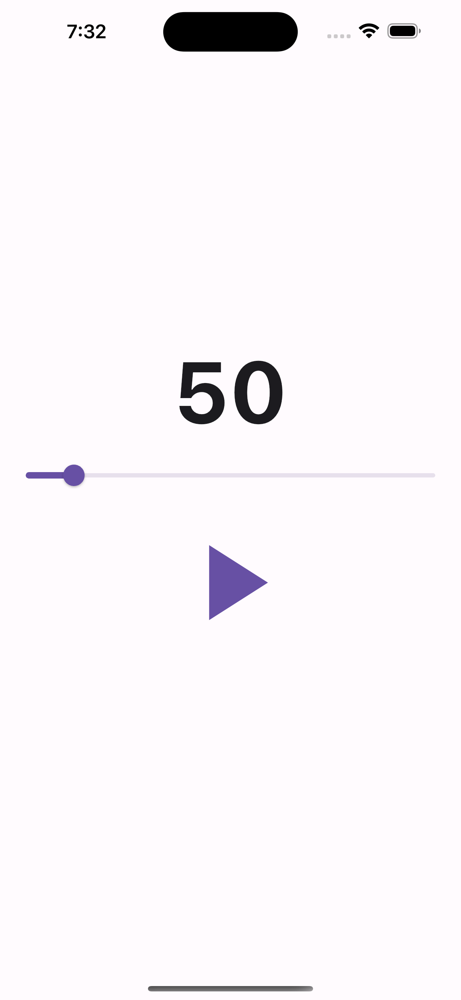

summary: Dans ce codelab, vous allez apprendre à développer une application Flutter en réalisant un métronome
id: docs
categories: Flutter
tags: beginner
status: Published
authors: Jérémy Riverain
Feedback Link: https://github.com/Zenika/codelab-flutter-metronome/issues

# Développer une application Flutter

<!-- ------------------------ -->

## Introduction

Duration: 2


### Ce que vous allez réaliser



<!-- ------------------------ -->

## Configurer l’environnement

Duration: 2

```
flutter doctor
flutter create metronome
cd metronome
rm lib/main.dart
rm -rf test
```

<!-- ------------------------ -->

## Ajouter les premiers composants structurants

### Afficher "Hello Flutter"

```dart
// lib/main.dart

import 'package:flutter/material.dart';
import 'package:metronome/app.dart';

void main() {
  runApp(const App());
}
```

```dart
// lib/ui/app.dart

import 'package:flutter/material.dart';

class App extends StatelessWidget {
  const App({super.key});

  @override
  Widget build(BuildContext context) {
    return MaterialApp(
      home: Scaffold(
        body: Center(
          child: Text(
            'Hello Flutter',
            style: Theme.of(context).textTheme.displayMedium,
          ),
        ),
      ),
    );
  }
}
```

### Afficher le rythme du métronome

```dart
// lib/ui/rhythm_label.dart

import 'package:flutter/material.dart';

class RhythmLabel extends StatelessWidget {
  const RhythmLabel({super.key});
  @override
  Widget build(BuildContext context) {
    return Text(
      '50',
      style: Theme.of(context).textTheme.displayLarge?.copyWith(
            fontSize: 80,
            fontWeight: FontWeight.bold,
          ),
    );
  }
}
```

```dart
// lib/ui/app.dart

import 'package:flutter/material.dart';
import 'package:metronome/ui/rhythm_label.dart'; // importer RhythmLabel

class App extends StatelessWidget {
  const App({super.key});

  @override
  Widget build(BuildContext context) {
    return MaterialApp(
      home: Scaffold(
        body: Center(
            child: RhythmLabel(), // remplacer le texte précédent par RhythmLabel
        ),
      ),
    );
  }
}
```

### Afficher le "slider" permettant de modifier le rythme

```dart
// lib/ui/rhythm_slider.dart

import 'package:flutter/material.dart';

class RhythmSlider extends StatelessWidget {
  const RhythmSlider({super.key});
  @override
  Widget build(BuildContext context) {
    return Slider(
      value: 50,
      min: 30,
      max: 200,
      onChanged: (value) {},
    );
  }
}
```

```dart
// lib/ui/app.dart
import 'package:flutter/material.dart';
import 'package:metronome/ui/rhythm_label.dart';
import 'package:metronome/ui/rhythm_slider.dart'; // importer RhythmSlider

class App extends StatelessWidget {
  const App({super.key});

  @override
  Widget build(BuildContext context) {
    return MaterialApp(
      home: Scaffold(
        body: Center(
          // utiliser Column pour afficher plusieurs widgets dans une colonne
          child: Column(
            mainAxisAlignment: MainAxisAlignment.center,
            children: [
              RhythmLabel(),
              Padding( // ajouter un peu d'espacement en haut et en bas du slider
                padding: const EdgeInsets.symmetric(vertical: 8),
                child: RhythmSlider(), // utiliser RhythmSlider
              ),
            ],
          ),
        ),
      ),
    );
  }
}
```

### Afficher le bouton permettant de démarrer/arrêter le métronome

```dart
// lib/ui/rhythm_toggle_button.dart

import 'package:flutter/material.dart';

class RhythmToggleButton extends StatefulWidget {
  const RhythmToggleButton({super.key});

  @override
  State<RhythmToggleButton> createState() => _RhythmToggleButtonState();
}

class _RhythmToggleButtonState extends State<RhythmToggleButton> {
  bool isPlaying = false;
  @override
  Widget build(BuildContext context) {
    return TextButton(
      onPressed: () {
        setState(() {
          isPlaying = !isPlaying;
        });
      },
      child: Icon(
        isPlaying ? Icons.pause : Icons.play_arrow,
        size: 120,
      ),
    );
  }
}
```

```dart
// lib/ui/app.dart

import 'package:flutter/material.dart';
import 'package:metronome/ui/rhythm_label.dart';
import 'package:metronome/ui/rhythm_slider.dart';
import 'package:metronome/ui/rhythm_toggle_button.dart'; // importer RhythmToggleButton

class App extends StatelessWidget {
  const App({super.key});

  @override
  Widget build(BuildContext context) {
    return MaterialApp(
      home: Scaffold(
        body: Center(
          child: Column(
            mainAxisAlignment: MainAxisAlignment.center,
            children: [
              RhythmLabel(),
              Padding(
                padding: const EdgeInsets.symmetric(vertical: 8),
                child: RhythmSlider(),
              ),
              RhythmToggleButton(), // utiliser RhythmToggleButton
            ],
          ),
        ),
      ),
    );
  }
}
```

### Ajuster le thème général

```dart
// lib/ui/app.dart

import 'package:flutter/material.dart';
import 'package:metronome/ui/rhythm_label.dart';
import 'package:metronome/ui/rhythm_slider.dart';
import 'package:metronome/ui/rhythm_toggle_button.dart'; // importer RhythmToggleButton

class App extends StatelessWidget {
  const App({super.key});

  @override
  Widget build(BuildContext context) {
    return MaterialApp(
      theme: ThemeData(
        useMaterial3: true, // activation de Material Design 3
      ),
      debugShowCheckedModeBanner: false, // dissimule la bannière "debug"
      home: Scaffold(
        body: Center(
          child: Column(
            mainAxisAlignment: MainAxisAlignment.center,
            children: [
              RhythmLabel(),
              Padding(
                padding: const EdgeInsets.symmetric(vertical: 8),
                child: RhythmSlider(),
              ),
              RhythmToggleButton(), // utiliser RhythmToggleButton
            ],
          ),
        ),
      ),
    );
  }
}
```


<!-- ------------------------ -->

## Rendre l’application responsive

Duration: 2

TODO

<!-- ------------------------ -->

## Jouer un son à intervalle régulier

Duration: 2

TODO

<!-- ------------------------ -->

## Modifier le rythme du métronome

Duration: 2

TODO

<!-- ------------------------ -->

## Tester les fonctionnalités du métronome

Duration: 2

TODO

<!-- ------------------------ -->

## Exécuter les tests en CI

Duration: 2

TODO

<!-- ------------------------ -->

## Félicitations

Duration: 2

TODO
